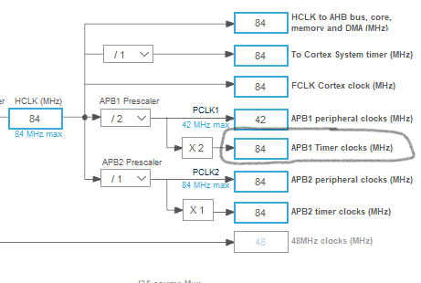
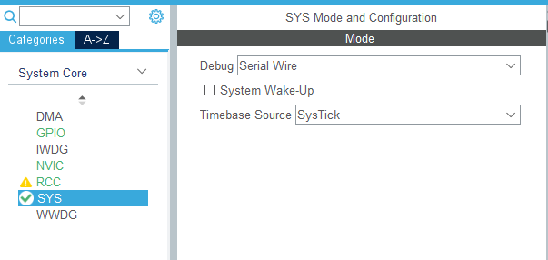
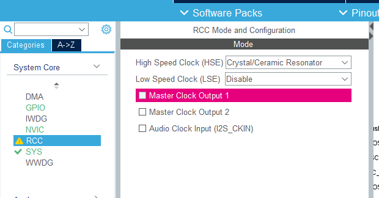
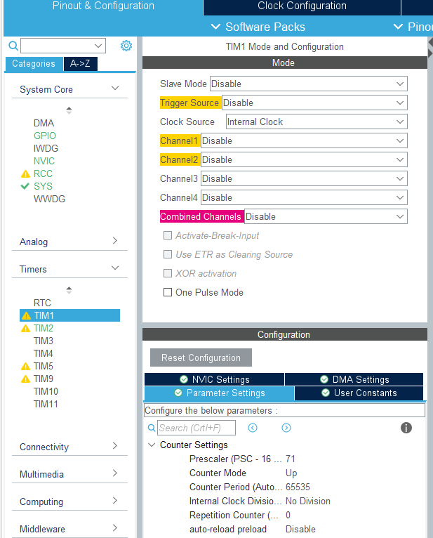
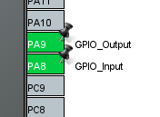
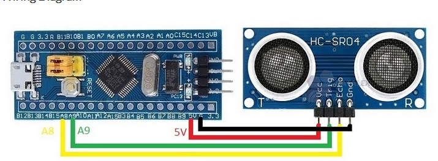

Pour servomoteur :
Stm32cube IDE
Création projet basique -> allez dans CLOCK COnfigugation dans le fichier.ioc
Ensuite regarder la valeur de la clock APB1
 
 

Donc ici elle vaut 84MHz.
Ensuite Aller dans Pinout&configuration 
Timers->TIM2
Clock source = Internal clock
Channel1=PWM Generation CH1
Ensuite en dessous dans configuration allez dans parameter settings
Prescaler = 84-1 ici le tiret 1 permet de définir la valeur de la clock du timer à 1MHz
Counter Mode = UP
Counter Period = 20000 pour avoir une période qui vaut 50 HZ
Scroll vers le bas 
PWM Generation channel 1 : Mode PWM mode 1 :
				Pulse : 500

Allez vois dans GPIO settings si c’est bon. 
Après cela allez dans project -> build all cela va vous créer les configurations que vous avez mis. Et compléter votre main.c automatiquement.
PIN du PWM ici c’est PA0

CAPTEUR ULTRASONS:

 

 

 

 

 

https://www.micropeta.com/video42

https://www.youtube.com/watch?v=l5msGz2tZP0

https://www.youtube.com/watch?v=9uBAgrvbaBY

